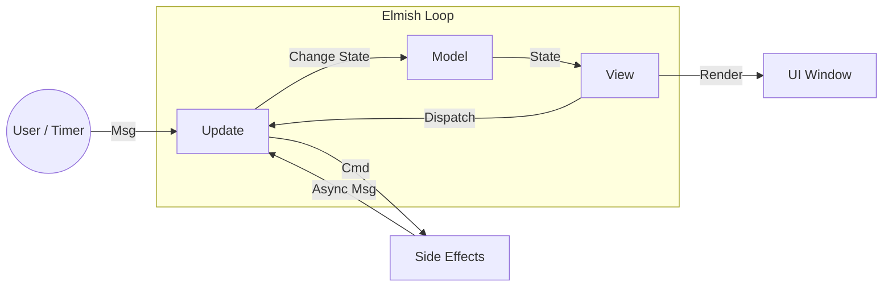
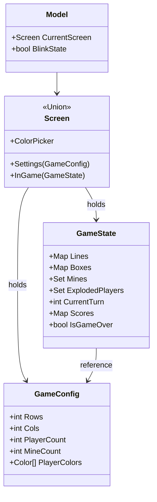
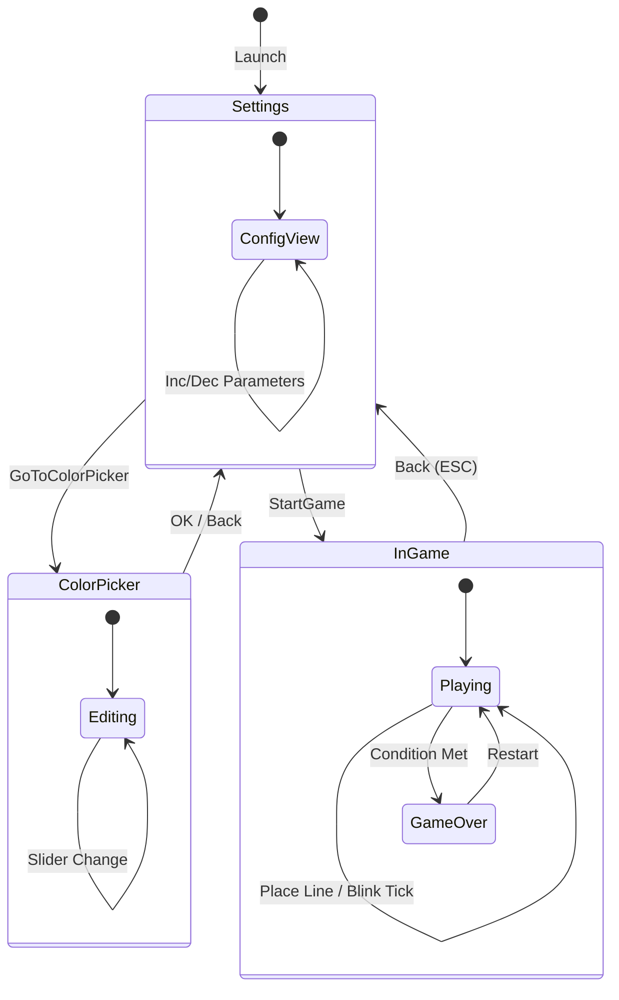
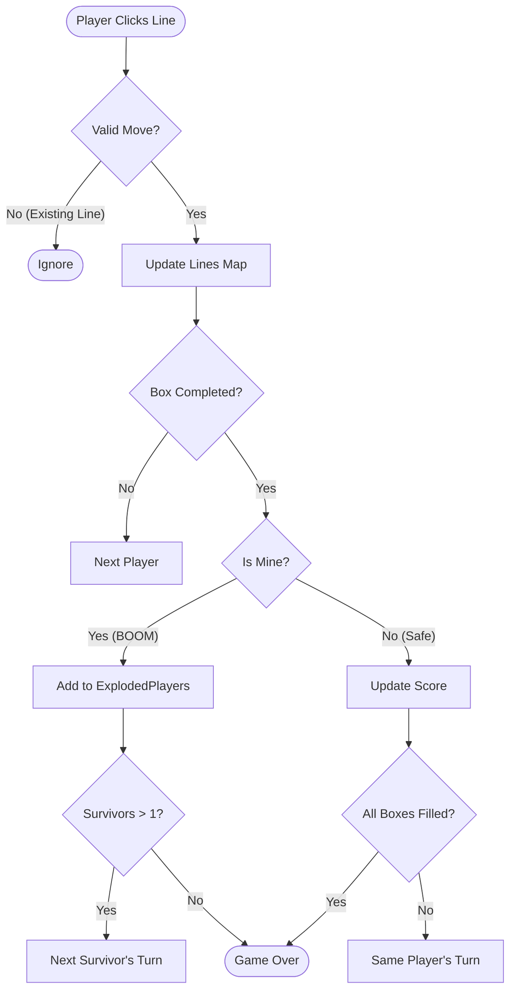
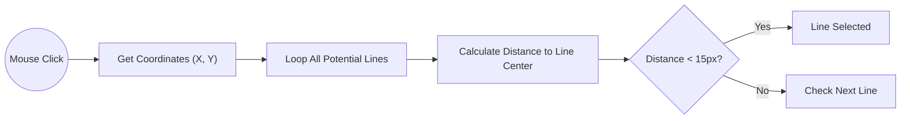

# アーキテクチャガイド

このドキュメントでは、**Mine Dots and Boxes** プロジェクトの技術的な構成について解説します。

## 概要

このアプリケーションは、F# と Avalonia.FuncUI を使用した **シングルファイル・アプリケーション** です。
**Elmish (MVU)** アーキテクチャを採用しており、状態（State）、ロジック（Logic）、表示（View）が明確に分離されています。

### MVU データフロー

## ファイル構成

すべてのコードは `MineDotsAndBoxesAvalonia/Program.fs` に集約されています。
ファイル内は以下のセクション順に構成されています。

1.  **Imports & Aliases**: 必要な名前空間とエイリアス定義。
2.  **Domain**: ゲームの核となる型定義。
3.  **Game Logic**: ゲームのルールを記述した純粋関数群。
4.  **App Model & Update**: アプリケーション全体の状態定義とメッセージ処理。
5.  **View**: Avalonia.FuncUI DSL を使ったUI定義。
6.  **App Entry**: `MainWindow` クラスとエントリーポイント。

## データ構造 (Domain)

主要なデータ型とその関係性は以下の通りです。

## アプリケーション遷移 (State Machine)

アプリケーションの画面遷移図です。

## ゲームロジック (Game Flow)

線を引いた際の判定ロジック（`tryPlaceLine` 関数）の流れです。

## ヒットテスト（クリック判定）

標準的なボタン部品を使わず、独自の計算で判定を行っています。

## 警告システム（点滅）

マインスイーパー要素である「警告」の実装です。

1.  **判定**: `View` 関数内で、描画しようとしている線の「隣接するボックス」を取得します。
2.  **条件**: 「隣接ボックスに爆弾がある」かつ「そのボックスが未獲得」の場合、警告フラグが立ちます。
3.  **描画**: `BlinkState`（タイマーで0.1秒ごとに反転）に基づき、線の色を赤/黄色に切り替えます。

## 今後の改善案
*   **効果音**: 線を引いたとき、爆発したとき、勝利したときに音を鳴らす。
*   **AI対戦**: 一人プレイ用に、ミニマックス法などを使ったCPU対戦相手の実装。